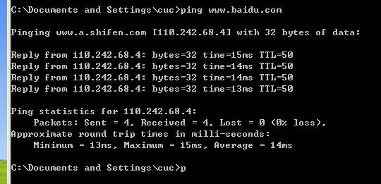

# 基于 VirtualBox 的网络攻防基础环境搭建

## 实验目的

- 掌握 VirtualBox 虚拟机的安装与使用；
- 掌握 VirtualBox 的虚拟网络类型和按需配置；
- 掌握 VirtualBox 的虚拟硬盘多重加载；

## 实验环境

- VirtualBox 虚拟机
- 攻击者主机（Attacker）：Kali 2022.3
- 网关（Gateway, GW）：Debian Buster
- 靶机（Victim）：From Sqli to shell / xp-sp3 / Kali

## 实验要求

- [x] 虚拟硬盘配置成多重加载；

- [x]  搭建满足如下拓扑图所示的虚拟机网络拓扑：


- [x] 完成以下网络连通性测试：
  
  - [x] 靶机可以直接访问攻击者主机
  - [x] 攻击者主机无法直接访问靶机
  - [x] 网关可以直接访问攻击者主机和靶机
  - [x] 靶机的所有对外上下行流量必须经过网关
  - [x] 所有节点均可以访问互联网

## 实验过程

### 虚拟机配置

虚拟硬盘设置成多重加载，如下图所示：


- **修改方法**：管理 -> 虚拟介质管理 -> 虚拟硬盘 -> 选择需要的 vdi 文件 -> 属性 -> 将类型修改为多重加载。

- 将 `Debian10.vdi` 、`kali-linux-2022.3-virtualbox-amd64.vdi` 、`xp_sp3_base.vdi` 设置成多重加载。

用以上虚拟硬盘文件导入实验所需的虚拟机，如下图所示：


### 网络配置

#### 网关配置

网卡情况：


| 网卡名称    | Virtual Box中的网络类型 | IP地址           |
|:-------:|:-----------------:|:--------------:|
| enp0s3  | NAT网络             | 10.0.2.15      |
| enp0s8  | Host-Only         | 192.168.56.113 |
| enp0s9  | 内部网络1（intnet1）    | 172.16.111.1   |
| enp0s10 | 内部网络2（intnet2）    | 172.16.222.1   |

#### 攻击者主机配置

网卡情况：


| 网卡名称 | Virtual Box 中的网络类型 | IP地址           |
|:----:|:------------------:|:--------------:|
| eth0 | NAT 网络             | 10.0.2.15      |
| eth1 | Host-Only          | 192.168.56.105 |
| eth2 | Host-Only          | 192.168.56.106 |

#### 内部网络1（intnet1）配置

##### Victim-XP-1

网卡情况：


| 网卡名称                  | Virtual Box 中的网络类型 | IP地址           |
|:---------------------:|:------------------:|:--------------:|
| Ethernet adapter 本地连接 | Intnet1            | 172.16.111.112 |

##### Victim-Kali-1

由于电脑性能原因，`victim-kali-1` 暂不进行配置

#### 内部网络2（intnet2）配置

##### Victim-Debian-2

网卡情况：


| 网卡名称   | Virtual Box 中的网络类型 | IP地址           |
|:------:|:------------------:|:--------------:|
| enp0s3 | Intnet2            | 172.16.222.110 |

##### Victim-XP-2

网卡情况：


| 网卡名称                  | Virtual Box 中的网络类型 | IP地址           |
|:---------------------:|:------------------:|:--------------:|
| Ethernet adapter 本地连接 | Intnet2            | 172.16.222.115 |

### 网络连通性测试

#### 1. 靶机可以直接访问攻击者主机

`Victim-XP-1` 访问 `Attack-Kali-2022`：


`Victim-XP-2` 访问 `Attack-Kali-2022`：


`Victim-Debian-2` 访问 `Attack-Kali-2022`：


#### 2. 攻击者主机无法访问靶机

测试结果如下图所示：

- `Attack-Kali-2022`访问靶机时均无回应，说明无法其访问靶机。


#### 3. 网关可以直接访问攻击者主机和靶机

`Gateway-Debian` 访问 `Attack-Kali-2022`：

- 可以 ping 通，说明可以访问。


`Gateway-Debian` 访问其他靶机：


#### 4. 靶机的所有对外上下行流量必须经过网关

使用老师提供的虚拟硬盘文件创建的虚拟机自带 `dnsmasq` ，并且已经设置了日志写到 `/var/log/dnsmasq.log` 里。

在网关中打开日志的方法：

```shell
tail -F /var/log/dnsmasq.log
```

在靶机中访问 `www.baidu.com`，此时靶机能够正常 ping 通。打开 `Gateway-Debian` 的 `dnsmasq.log` ，可以看到日志同步多出几条记录。如下图：


#### 5. 所有节点均可以访问互联网

`Gateway-Debian` 访问互联网：


`Attack-Kali-2022` 访问互联网：


`Victim-Debian-2` 访问互联网：


`Victim-XP-1` 访问互联网：



`Victim-XP-2` 访问互联网：


## 实验中遇到的问题及解决方法

### 1. 将磁盘类型改为多重加载时出错

**问题**：在将虚拟硬盘配置成多重加载时，出现如下报错：


**尝试解决的过程**：

经过查看错误明细里的提示和查阅资料，发现该虚拟硬盘还挂载在虚拟机上，于是我首先将盘片从虚拟机中删除，操作如下图所示：


操作完成后依旧报错，于是我又在虚拟介质管理中将 `Debian10.vdi` 释放并删除叶子结点，但依旧无法完成类型转换：


**最终解决方法**：在经过黄老师的点拨下，我重新将老师给的 vdi 文件导入新的虚拟机中，没有配其他的 iso 文件，也没有开机装系统，才成功将该磁盘文件类型改为多重加载。

### 2. WinXp 系统靶机无法显示 IP 地址

**问题**：在通过 `ipconfig` 查看 WinXP 系统的虚拟机 IP 地址时，出现如下图情况：


**解决方法**：经过阅读其他同学的报告，发现也有同学遇到了相同的问题。需要修改网卡中的控制芯片类型为`PCnet-FAST III` 芯片，操作步骤如下图：


### 3. 网关无法 ping 通 WinXp 系统靶机

**问题**：在进行网络连通性测试时，使用网关 `Gateway-Debian` 访问靶机 `Victim-XP-1 `和 `Victim-XP-2` 时，出现无响应的情况。

**解决方法**：经过查阅资料和师哥师姐们的实验报告，发现是 WinXP 系统中自带的防火墙的问题。需要在 Windows 安全中心设置`允许传入回显请求`。具体操作如下图所示：


## 参考资料

- [参考实验报告1](https://github.com/CUCCS/2021-ns-public-EddieXu1125/blob/1a165078f8352c5b9f25af50b5527349bf5dc799/chap0x01/README.md)

- [参考实验报告2](https://github.com/CUCCS/2021-ns-public-luminous-123/blob/chap0x01/chap0x01/Chap0x01%E5%AE%9E%E9%AA%8C%E6%8A%A5%E5%91%8A.md)

- [参考实验报告3](https://github.com/CUCCS/2022-ns-public-echo-li-cuc/blob/251492b431516117b89a606e51796b471a335712/chap0x01/chap0x01%E5%AE%9E%E9%AA%8C%E6%8A%A5%E5%91%8A.md)

- [ping不通网络的原因 -知乎](https://zhuanlan.zhihu.com/p/352099467)

- [Virtualbox 多重加载 高级功能介绍_jeanphorn的博客-CSDN博客_virtualbox多重加载](https://blog.csdn.net/jeanphorn/article/details/45056251)
