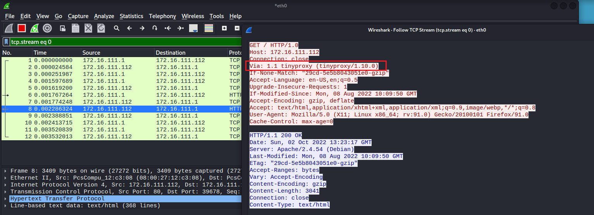

# 第三章：HTTP 代理服务器实验

## 实验目的

探究 `使用 http 代理服务器访问 HTTPS 站点时，代理服务器是否能获知通信传输内容？`

> 结论是代理服务器不知道客户端和服务器的HTTPS通信内容，但代理服务器知道客户端访问了哪个HTTPS站点，这是由http代理的协议机制决定的：代理客户端会发送Connect请求到http代理服务器。

## 实验验证流程

- 在 Gateway-Debian 中安装 tinyproxy

- 用主机设置浏览器代理指向 tinyproxy 建立的 HTTP 正向代理

- 在 Gateway-Debian 中用 wireshark 抓包

- 分析抓包过程，理解 HTTP 正向代理 HTTPS 流量的特点。

## 实验环境准备

#### 实验所需的虚拟机设备

- 攻击者主机（Attack-Kali）： Kali 2022.3
- 网关（Gateway-Kali）：Debian Buster
- 靶机（Victim-Kali）：Kali 2022.3

#### 拓扑结构


#### 连通性测试

|     | 攻击者 | 网关  | 靶机    |
|:---:|:---:|:---:|:-----:|
| 攻击者 | -   | √   | ×     |
| 网关  | √   | -   | √     |
| 靶机  | √   | √   | -实验过程 |

攻击者可以ping通网关，不能ping通靶机，可以上网：


网关可以ping通攻击者，可以ping通靶机，可以上网：


靶机可以ping通攻击者，可以ping通网关，可以上网：


## 实验过程

### 1. 在网关配置tinyproxy

```shell
apt update 
apt install tinyproxy

# 备份tinyproxy配置文件
cp /etc/tinyproxy/tinyproxy.conf /etc/tinyproxy/tinyproxy.conf.bak

# 编辑tinyproxy配置文件
vim /etc/tinyproxy/tinyproxy.conf

# 开启tinyproxy服务
systemctl start tinyproxy

#查看tinyproxy服务状态
systemctl status tinyproxy.service
```

编辑 tinyproxy 配置文件，允许 NAT 网络内的节点使用网关的代理服务，默认 tinyproxy 监听 8888 端口：


查看 tinyproxy 服务状态，确认 tinyproxy 启动成功：


### 2. 使用tinyproxy访问靶机

在攻击者主机上打开 Firefox，在 `setting` 中搜索 `connection setting` 进入代理设置，填写网关IP及端口号：


在攻击者的firefox上配置并选择启用代理服务器后，同时在攻击者、网关、靶机开启抓包。

#### 攻击者抓包

使用 Firefox 访问靶机`172.16.111.112`和`172.16.111.112/hack`，分别显示 Apache 默认页面和 404 页面，没有直接给出代理服务器信息


**抓包**：

- 打开 wireshark，选中本地网卡"eth0"，并取消混杂模式。

- 使用 wireshark 进行抓包分析，抓到相关 http 包后右键点击选择 `follow` ，再选择 `tcp stream` 即可查看 http 响应内容，发现 http 响应里含有 `Via: 1.1 tinyproxy (tinyproxy/1.10.0)` 字段。
  
  
  
  

#### 靶机抓包

同理使用 wireshark 进行抓包分析，查看 http 响应内容，发现 http 响应里含有 `Via: 1.1 tinyproxy (tinyproxy/1.10.0)` 字段。

- HTTP协议中有 `Via: 1.1 tinyproxy (tinyproxy/1.10.0)` 字段，说明网关（代理服务器）正在提供代理服务。

- 攻击者主机IP地址、以太网接口均未暴露。



#### 网关抓包

- 由于Debian无可视化界面，可以使用如下语句将在网关抓包到的文件传送到靶机上，以便于用 Wireshark 分析。
  
  ```shell
  #将抓包文件保存
  tcpdump -w result.cap 
  
  #将result.cap文件传送到靶机的桌面上，注意两个路径之间有且仅有一个空格
  scp -r root@172.16.111.1:/root/result.cap /home/kali/Desktop/ 
  ```
  
  
  
  

- 使用 wireshark 查看 http 响应内容，发现 http 响应里含有 `Via: 1.1 tinyproxy (tinyproxy/1.10.0)字段`。
  
  - 网关保留 HTTP GET 请求内容，若攻击者主机的浏览器不清除历史记录，则下次访问同样的 HTTP 服务时用非常短。
  
  - 若在网关设置防火墙规则过滤攻击者主机发出的的请求，则攻击者主机依然无法访问靶机端的 HTTP 服务。
  
  - 代理层可以理解 HTTP 报文。
  
  

### 3. 使用tinyproxy访问https页面

- 在攻击机 Attack-Kali 上通过火狐浏览器访问[百度](https://www.baidu.com/)，在网关 Debian-gw 上进行抓包，并使用 `scp` 语句传至 kali-victim 主机上进行分析。


- 经过观察与分析以后可以得出结论，使用 https，代理服务器网关知道客户端访问了哪个 HTTPS 站点，这是由http代理的协议机制决定的：代理客户端会发送Connect请求到http代理服务器。但是看不到具体的传输数据，因为数据已经被加密成乱码。

## 实验总结

- 不要轻信代理服务器的安全性

- 代理服务器不知道客户端和服务器的HTTPS通信内容，但代理服务器知道客户端访问了哪个HTTPS站点

- 代理服务器与用户之间的数据交流是明文传输，所以会涉及信息的泄露

- 在使用开放代理时必须谨慎，有可能受到中间人攻击。

## 遇到的问题及解决方法

### 1. 无法显示靶机的ip地址，网络配置出错

**问题**：在一开始我使用 Debian 系统作为网关，Kali 系统作为靶机，网关与靶机之间使用内部网络，查询靶机的 ip 地址时无法正常显示，而网关中显示 `169.254` 开头的 ip 地址。


**错误原因**：经过黄玮老师的点拨，我得知是网关的网卡配置出了问题。网关上的第二块网卡正常情况下配置的是 host only ，从第三块网卡开始配的是内部网络，而我在配置网关网络时将第二块网卡直接配成了内部网络。

**为什么一定要这样配置呢？**

- 网关上是有配置 DHCP 服务的，我们的靶机或者是我们的攻击者主机，连到内部网络，想要获取一个有效的IP地址的前提是得按照网关的DHCP服务的配置，因为我们是硬编码的网关DHCP作用的这样一个网卡，而按照我之前的操作，即在网关中只设置两张网卡，其实是缺少网卡的，数量是对不上硬编码的配置文件的。

- 除此之外，`169.254` 开头的 ip 地址不是有效的 ip，是 DHCP 失败之后的一个保留 ip。

### 2. 由于我的Debian没有装可视化界面，不方便使用Wireshark进行流量分析。

**解决办法**：经过查阅相关资料和参考同学的实验报告，发现可以使用 `tcpdump` 抓包命令进行抓包，再通过 `scp` 命令将抓包到的 `.cap` 文件在两台虚拟机间传输，即将在网关抓到的流量包传输到靶机上，以便于可视化分析。

## 参考链接

- [以169 开头的IP 地址是什么呢？ - 知乎](https://www.zhihu.com/question/496523449)

- [tcpdump 抓包命令使用教程](https://zhuanlan.zhihu.com/p/74812069)

- [使用 scp 命令进行远程复制 - 在 Oracle Solaris 11.1 中管理远程系统](https://docs.oracle.com/cd/E37934_01/html/E36614/remotehowtoaccess-55154.html)

- [参考实验报告1](https://github.com/CUCCS/2021-ns-public-Lychee00/blob/chap0x03/chap0x03/report03.md)

- [参考实验报告2](https://github.com/CUCCS/2021-ns-public-EddieXu1125/blob/a033cabe2914308bdc95a6b919c20dec22530f06/chap0x03/README.md)
