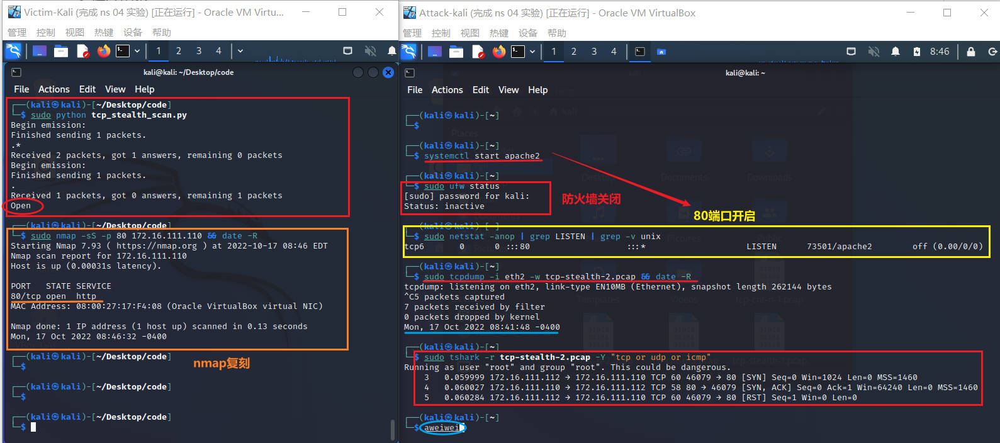
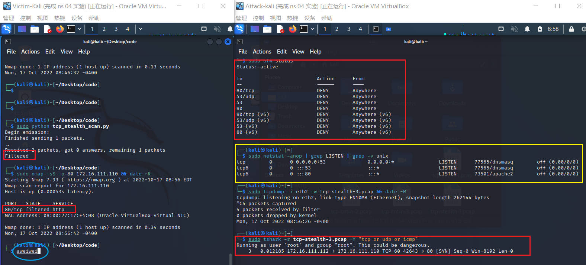
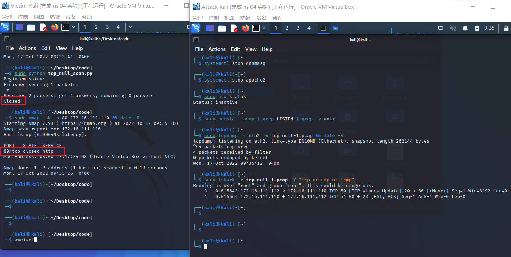

# 基于 Scapy 编写端口扫描器

## 实验目的

- 掌握网络扫描之端口状态探测的基本原理

## 实验环境

- Python 3.10.5
- scapy 2.4.4
- nmap 7.93
- 攻击者主机 `Attack - Kali`：Kali 2022.3
- 受害者主机 `Victim - Kali`：Kali 2022.3
- 网关 `Gateway - Debian`：Debian Buster

## 实验要求

- [x] 完成以下扫描技术的编程实现
  
  - [x]  TCP connect scan / TCP stealth scan
  
  - [x] TCP Xmas scan / TCP fin scan / TCP null scan
  
  - [x] UDP scan

- [x] 上述每种扫描技术的实现测试均需要测试端口状态为：`开放`、`关闭`和`过滤`状态时的程序执行结果

- [x] 禁止探测互联网上的 IP ，严格遵守网络安全相关法律法规；

- [x] 提供每一次扫描测试的抓包结果并分析与课本中的扫描方法原理是否相符？如果不同，试分析原因；

- [x] 在实验报告中详细说明实验网络环境拓扑、被测试 IP 的端口状态是如何模拟的

- [x] 复刻 `nmap` 的上述扫描技术实现的命令行参数开关

## 实验过程

### 网络拓扑

与实验四的网络拓扑结构相似：


### 端口状态设置

端口状态模拟：

- 关闭状态：对应端口没有开启监听，防火墙没有开启。

- 开启状态：对应端口开启监听，防火墙处于关闭状态。

- 过滤状态：对应端口开启监听，防火墙开启。

使用 ufw 相关命令：

- apache2 基于 TCP，在 80 端口提供服务;
- DNS 服务基于 UDP，在 53 端口提供服务。

```shell
#安装ufw
sudu apt update && apt install ufw
#查看当前防火墙的状态和现有规则
ufw status
#端口关闭状态
sudo ufw disable
#允许端口访问
sudo ufw enable
#端口过滤状态
sudo ufw enable && sudo ufw deny 80/tcp
sudo ufw enable && sudo ufw deny 53/udp
```

开启和关闭端口：

```shell
#开启
systemctl start apache2 # port 80
systemctl start dnsmasq # port 53
#关闭
systemctl stop apache2 # port 80
systemctl stop dnsmasq # port 53
```

安装 `nmap`：

```shell
#下载安装
sudo apt update && sudo apt install nmap
#相关命令
sudo nmap -sT -p <port> <ip>
sudo nmap -sS -p <port> <ip>
sudo nmap -sX -p <port> <ip>
sudo nmap -sF -p <port> <ip>
sudo nmap -sN -p <port> <ip>
sudo nmap -sU -p <port> <ip>
```

安装 `dnsmasq`：

```shell
sudo apt update && sudo apt install dnsmasq
```

### 完成以下扫描技术的编程实现

#### 1. TCP connect scan

> 这种扫描方式可以使用 Connect() 调用，使用最基本的 TCP 三次握手链接建立机制，建立一个链接到目标主机的特定端口上。首先发送一个 SYN 数据包到目标主机的特定端口上，接着我们可以通过接收包的情况对端口的状态进行判断。

三种情况下的不同响应：

- 接收 SYN/ACK 数据包，说明端口是开放状态的；
- 接收 RST/ACK 数据包，说明端口是关闭的并且链接将会被重置；
- 目标主机没有任何响应，意味着目标主机的端口处于过滤状态。

> 若接收到 SYN/ACK 数据包（即检测到端口是开启的），便发送一个 ACK 确认包到目标主机，这样便完成了三次握手连接机制。成功后再终止连接。

**code**

```python
from scapy.all import *

src_port = RandShort()
dst_ip = "172.16.111.110"
dst_port = 80

resp = sr1(IP(dst=dst_ip)/TCP(sport=src_port,dport=dst_port,flags="S"),timeout=10)

if resp is None:
    print ("Filtered")

elif(resp.haslayer(TCP)):
    if (resp.getlayer(TCP).flags == 0x14):   
        print ("Closed")
    elif(resp.getlayer(TCP).flags == 0x12): 
        send_rst = sr(IP(dst=dst_ip)/TCP(sport=src_port,dport=dst_port,flags="AR"),timeout=10)
        print ("Open")
```

**nmap**

```shell
nmap -sT -p 80 172.16.111.110
```

**抓包命令使用**：

`tcpdump` 命令：

- `-i`：指定要过滤的网卡接口

- 使用 `-w` 参数后接一个以 `.pcap` 后缀命令的文件名，就可以将 tcpdump 抓到的数据保存到文件中

`tshark` 命令：

- `-r test.pcap` 需要分析的报文记录文件（pcap格式）
- `-Y` 显示过滤

**端口关闭**：


- nmap 复刻
  
  

**端口开启**：


- nmap 复刻
  
  

**端口过滤**：


- nmap 复刻
  
  

#### 2. TCP stealth scan

> 先发送一个S，然后等待回应。如果有回应且标识为RA，说明目标端口处于关闭状态；如果有回应且标识为SA，说明目标端口处于开放状态。这时TCP stealth scan只回复一个R，不完成三次握手，直接取消建立连接。

**code**

```python
from scapy.all import *

src_port = RandShort()
dst_ip = "172.16.111.110" 
dst_port = 80

stl_resp = sr1(IP(dst=dst_ip)/TCP(sport=src_port,dport=dst_port,flags="S"),timeout=10)

if stl_resp is None:
    print ("Filtered")

elif(resp.haslayer(TCP)):
    if (resp.getlayer(TCP).flags == 0x14):
        print ("Closed")
    elif(resp.getlayer(TCP).flags == 0x12):
        send_rst = sr(IP(dst=dst_ip)/TCP(sport=src_port,dport=dst_port,flags="R"),timeout=10)
        print ("Open")
```

**nmap**

```shell
nmap -sS -p 80 172.16.111.110
```

**端口关闭**：


- nmap 复刻
  
  

**端口开启**：（以下均包含 namp 复刻）



**端口过滤**：



#### 3. TCP Xmas scan

> 一种隐蔽性扫描，当处于端口处于关闭状态时，会回复一个RST包；其余所有状态都将不回复。

**code**

```python
from scapy.all import *

dst_ip = "172.16.111.110"
dst_port = 80

resp = sr1(IP(dst=dst_ip)/TCP(dport=dst_port,flags="FPU"),timeout=10)

if resp is None:
    print ("Open|Filtered")

elif(resp.haslayer(TCP)):
    if(resp.getlayer(TCP).flags == 0x14):
        print ("Closed")
```

**nmap**

```shell
nmap -sX -p 80 172.16.111.110
```

**端口关闭**：


**端口开启**：


**端口过滤**：


#### 4. TCP FIN scan

> 仅发送FIN包，FIN数据包能够通过只监测SYN包的包过滤器，隐蔽性较SYN扫描更⾼，此扫描与Xmas扫描也较为相似，只是发送的包未FIN包，同理，收到RST包说明端口处于关闭状态；反之说明为开启/过滤状态。

**code**

```python
from scapy.all import *

dst_ip = "172.16.111.110" 
dst_port = 80

resp = sr1(IP(dst=dst_ip)/TCP(dport=dst_port,flags="F"),timeout=10)

if resp is None:
    print ("Open|Filtered")

elif(resp.haslayer(TCP)):
    if(resp.getlayer(TCP).flags == 0x14):
        print ("Closed")
```

**nmap**

```shell
nmap -sF -p 80 172.16.111.110
```

**端口关闭**：


**端口开启**：


**端口过滤**：


#### 5. TCP NULL scan

> 发送的包中关闭所有TCP报⽂头标记，实验结果预期还是同理：收到RST包说明端口为关闭状态，未收到包即为开启/过滤状态.

**code**

```python
from scapy.all import *

dst_ip = "172.16.111.110" 
dst_port = 80

resp = sr1(IP(dst=dst_ip)/TCP(dport=dst_port,flags=""),timeout=10)


if resp is None:
    print ("Open|Filtered")

elif(resp.haslayer(TCP)):
    if(resp.getlayer(TCP).flags == 0x14):
        print ("Closed")
```

**nmap**

```shell
nmap -sN -p 80 172.16.111.110
```

**端口关闭**：



**端口开启**：


**端口过滤**：


#### 6. UDP scan

> 一种开放式扫描，通过发送UDP包进行扫描。当收到UDP回复时，该端口为开启状态；否则即为关闭/过滤状态.

**code**

```python
from scapy.all import *
def udpscan(dst_ip, dst_port, dst_timeout=10):    resp = sr1(IP(dst=dst_ip)/UDP(dport=dst_port), timeout=dst_timeout)    if (resp is None):        print("Open|Filtered")    elif (resp.haslayer(UDP)):        print("Open")    elif(resp.haslayer(ICMP)):        if(int(resp.getlayer(ICMP).type) == 3 and int(resp.getlayer(ICMP).code) == 3):            print("Closed")        elif(int(resp.getlayer(ICMP).type) == 3 and int(resp.getlayer(ICMP).code) in [1, 2, 9, 10, 13]):            print("Filtered")        elif(resp.haslayer(IP) and resp.getlayer(IP).proto == IP_PROTOS.udp):            print("Open")
udpscan('172.16.111.144', 53)
```

**nmap**

```shell
nmap -sU -p 53 172.16.111.110
```

**端口关闭**：


**端口开启**：


**端口过滤**：


## 实验总结

### 1. 扫描方式与端口状态的对应关系

| 扫描方式/端口状态                     | 开放                  | 关闭        | 过滤        |
| ----------------------------- | ------------------- | --------- | --------- |
| TCP connect / TCP stealth     | 完整的三次握手，能抓到ACK&RST包 | 只收到一个RST包 | 收不到任何TCP包 |
| TCP Xmas / TCP FIN / TCP NULL | 收不到TCP回复包           | 收到一个RST包  | 收不到TCP回复包 |
| UDP                           | 收到UDP回复包            | 收不到UDP回复包 | 收不到UDP回复包 |

### 2. 遇到的问题及解决方法

**问题**：在`端口过滤`的情况下在受害者主机中运行 py 程序时出现如下报错：


**解决方法**：仔细阅读错误信息，发现错误发生在 py 文件本身。程序会首先执行resp.haslayer(TCP)，而不检查是否resp is None，如下图所示。只需将两个if条件交换顺序即可。


## 参考资料

- [TCP Connect Scan (-sT) | Nmap Network Scanning](https://nmap.org/book/scan-methods-connect-scan.html)

- [TCP SYN (Stealth) Scan (-sS) | Nmap Network Scanning](https://nmap.org/book/synscan.html)

- [TCP FIN, NULL, and Xmas Scans (-sF, -sN, -sX) | Nmap Network Scanning](https://nmap.org/book/scan-methods-null-fin-xmas-scan.html)

- [TCP UDP Scan (-sU) | Nmap Network Scanning](https://nmap.org/book/scan-methods-udp-scan.html)

- [TCP标志位详解（TCP Flag）](https://blog.csdn.net/ChenVast/article/details/77978367)

- [全网最详细的tcpdump 使用指南- 王一白 - 博客园](https://www.cnblogs.com/wongbingming/p/13212306.html)

- [2021-ns-public-Lychee00-GitHub](https://github.com/CUCCS/2021-ns-public-Lychee00/blob/chap0x05/chap0x05/report05.md)
